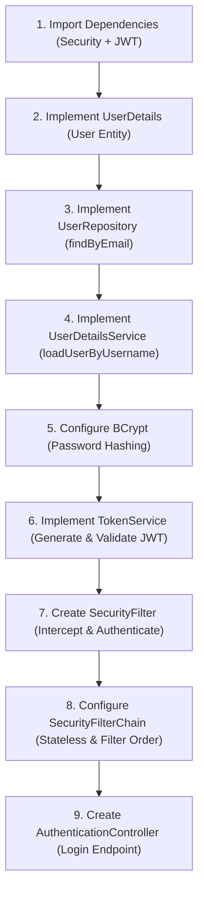

# Roadmap: Spring Security + JWT Authentication & Authorization

This roadmap outlines the complete end-to-end steps to implement stateless JWT token-based authentication and authorization in a Spring Boot REST API.

---



---

## 1. Import Dependencies
Add the Spring Security starters and a JSON Web Token library to your `pom.xml`.
* **Spring Security Starter**: Imports core security filters and default login configuration.
* **Java JWT (Auth0)**: Used for building, signing, and parsing JWTs.

```xml
<dependency>
    <groupId>org.springframework.boot</groupId>
    <artifactId>spring-boot-starter-security</artifactId>
</dependency>
<dependency>
    <groupId>com.auth0</groupId>
    <artifactId>java-jwt</artifactId>
    <version>4.5.2</version>
</dependency>
```

---

## 2. Configure the User Entity (`UserDetails`)
Spring Security does not authenticate raw entity classes directly. Your entity must implement the `UserDetails` interface.

* **Imports**: `org.springframework.security.core.userdetails.UserDetails`, `GrantedAuthority`, `SimpleGrantedAuthority`.
* **Key Implementations**:
  * `getAuthorities()`: Return a collection of `GrantedAuthority` mapping roles (e.g., `ROLE_STUDENT`).
  * `getUsername()`: Return the unique field used for identification (usually `email` or `username`).
  * `getPassword()`: Return the hashed password.
  * Account status flags (`isAccountNonExpired`, etc.) must return `true`.

---

## 3. Implement the Repository Method
Update your `UserRepository` to find users by their email/username.

```java
public interface UserRepository extends JpaRepository<User, Long> {
    User findByEmail(String email);
}
```

---

## 4. Implement `UserDetailsService`
Create a service class that Spring Security uses to load user credentials during authentication.

* **Class Annotation**: `@Service`
* **Interface**: Implements `UserDetailsService`
* **Key Implementation**:
  * Override `loadUserByUsername(String username)`.
  * Call your `UserRepository.findByEmail` method.
  * Throw a `UsernameNotFoundException` if the user is not found to prevent NullPointerExceptions.

---

## 5. Configure Password Hashing (BCrypt)
Ensure that user passwords are not stored in plain text.

* **Encoder Bean**: Expose `BCryptPasswordEncoder` as a bean in your security config class.
* **Usage**: Inject `PasswordEncoder` inside your registration logic (e.g., `UserService`) and call `passwordEncoder.encode(rawPassword)` before calling `userRepository.save()`.

---

## 6. Create the `TokenService`
Create a service dedicated to handling JWT creation and signature verification.

* **Key Implementations**:
  * `generateToken(User user)`: Signs and creates a JWT containing the user's email as the subject, along with an issuer and expiration date.
  * `getSubject(String tokenJWT)`: Verifies the signature of the incoming token using the shared secret and extracts the email subject.
  * *Important*: Catch `JWTVerificationException` for validation errors (expired or tampered tokens).

---

## 7. Create the `SecurityFilter`
Create a custom servlet filter that runs on every request to intercept, parse, and validate incoming JWTs.

* **Class Class**: Extends `OncePerRequestFilter`.
* **Key Implementation**:
  * Override `doFilterInternal(...)`.
  * Retrieve the `Authorization` HTTP header.
  * Extract the raw token (strip the `Bearer ` prefix).
  * Validate the token using `TokenService` to retrieve the subject (user email).
  * If valid, retrieve the user from `UserRepository` and store the authentication object in the thread's security context:
    ```java
    var authentication = new UsernamePasswordAuthenticationToken(user, null, user.getAuthorities());
    SecurityContextHolder.getContext().setAuthentication(authentication);
    ```
  * Call `filterChain.doFilter(request, response)` to pass the request down the chain.

---

## 8. Configure the `SecurityConfigurations`
Write a configuration class to bind the filter chain and endpoints rules together.

* **Annotations**: `@Configuration`, `@EnableWebSecurity`, `@EnableMethodSecurity`.
* **Key Beans**:
  * `SecurityFilterChain`: Configure CSRF to be disabled (since REST APIs are stateless), set session management to `SessionCreationPolicy.STATELESS`, authorize specific endpoints (e.g. `/login` is public), and register the custom filter:
    ```java
    http.addFilterBefore(securityFilter, UsernamePasswordAuthenticationFilter.class)
    ```
  * `AuthenticationManager`: Expose the manager bean required by your login controller.

---

## 9. Create the `AuthenticationController` & DTOs
Create the REST controller that handles incoming authentication requests.

* **DTOs**: Create request records like `AuthenticationDTO` (email, password) and response records like `TokenJWTData` (token string).
* **Login Endpoint**:
  * Instantiate an unauthenticated `UsernamePasswordAuthenticationToken` using the login request credentials.
  * Call `authManager.authenticate(token)`.
  * If successful, fetch the authenticated principal, cast it to `User`, generate the JWT using `TokenService`, and return it inside the response DTO.
